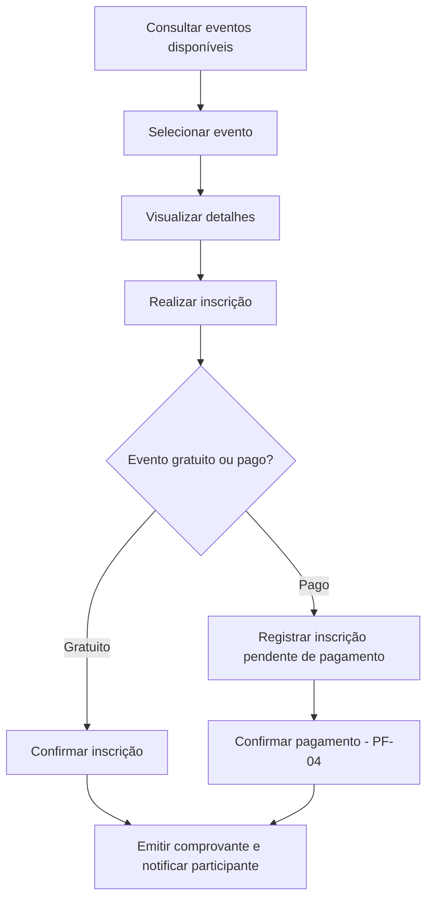
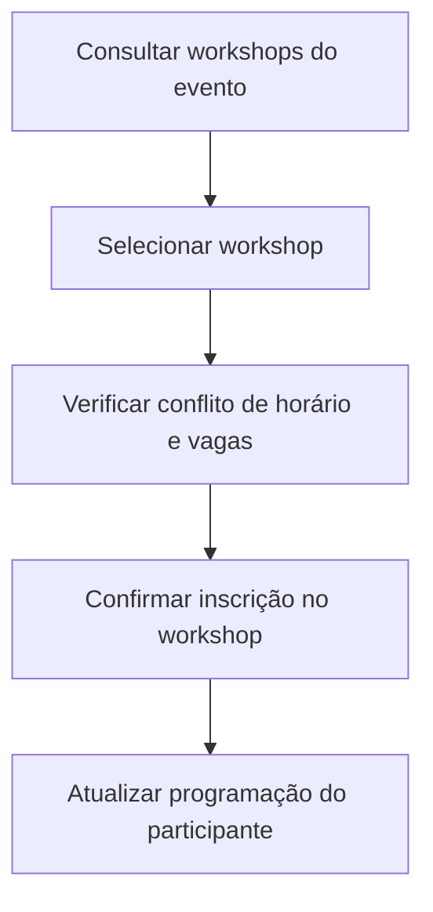
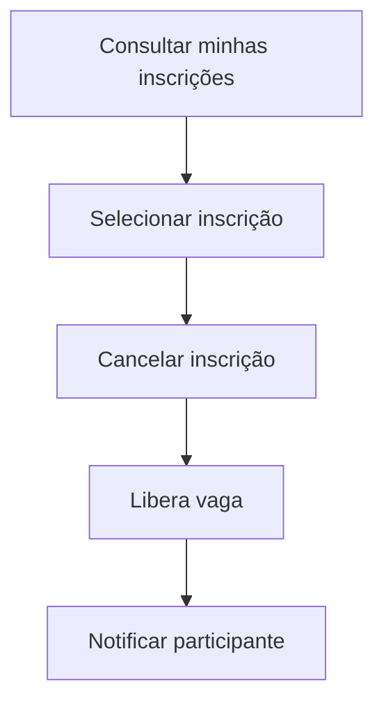
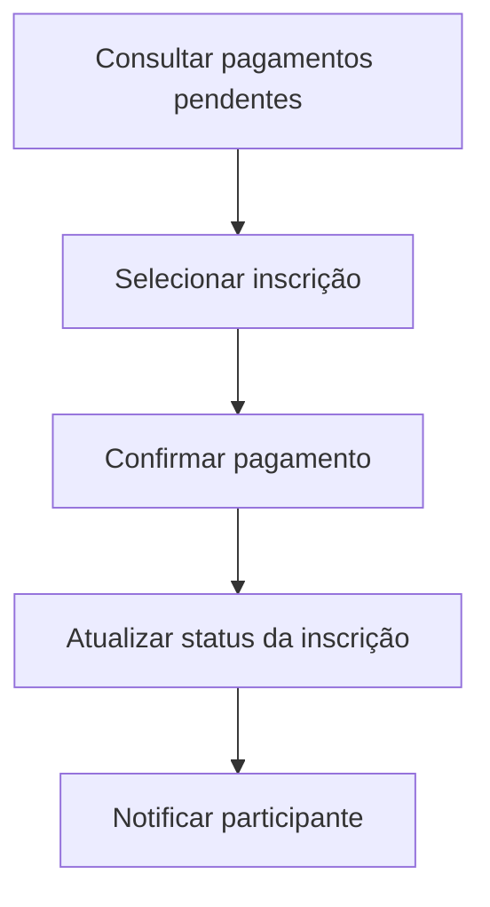
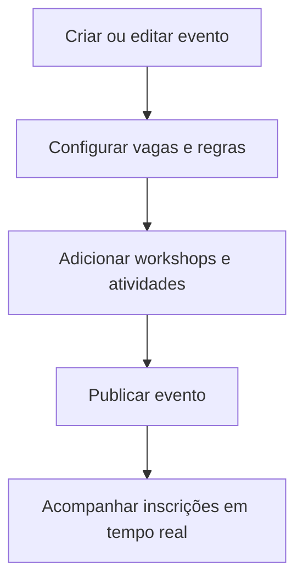
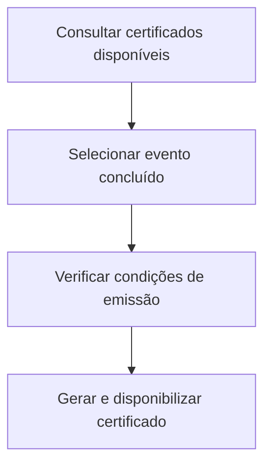
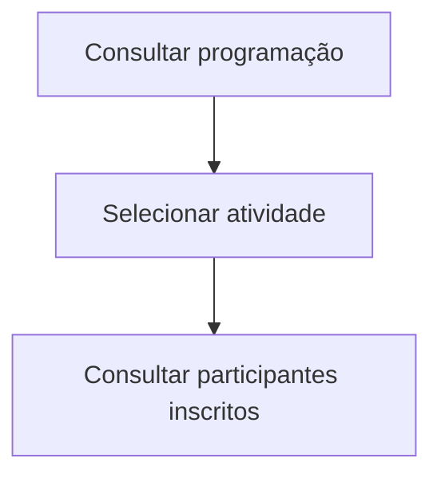

# Protótipos e Fluxos

> Fluxos principais derivados dos casos de uso (UC) e histórias de usuário (HU).

---

## PF-01 — Consulta e inscrição em evento

**Rastreabilidade:** UC-01, UC-02 | HU-01, HU-02

---

## PF-02 — Inscrição em workshops

**Rastreabilidade:** UC-03 | HU-03

---

## PF-03 — Cancelamento de inscrição

**Rastreabilidade:** UC-04 | HU-06

---

## PF-04 — Confirmação de pagamento

**Rastreabilidade:** UC-09 | HU-13

---

## PF-05 — Gestão de eventos

**Rastreabilidade:** UC-07, UC-08 | HU-09, HU-10

---

## PF-06 — Emissão de certificado

**Rastreabilidade:** UC-11 | HU-08

---

## PF-07 — Consulta do palestrante

**Rastreabilidade:** UC-12, UC-13 | HU-15, HU-16

