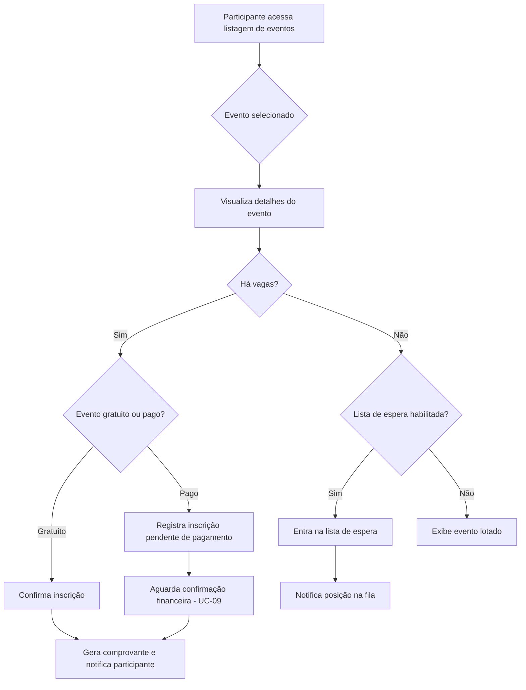
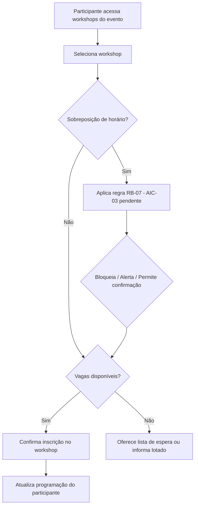
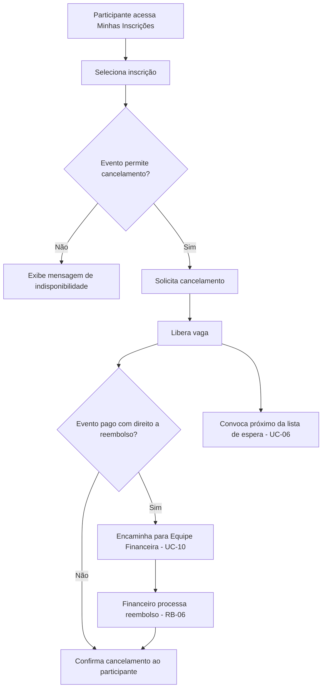
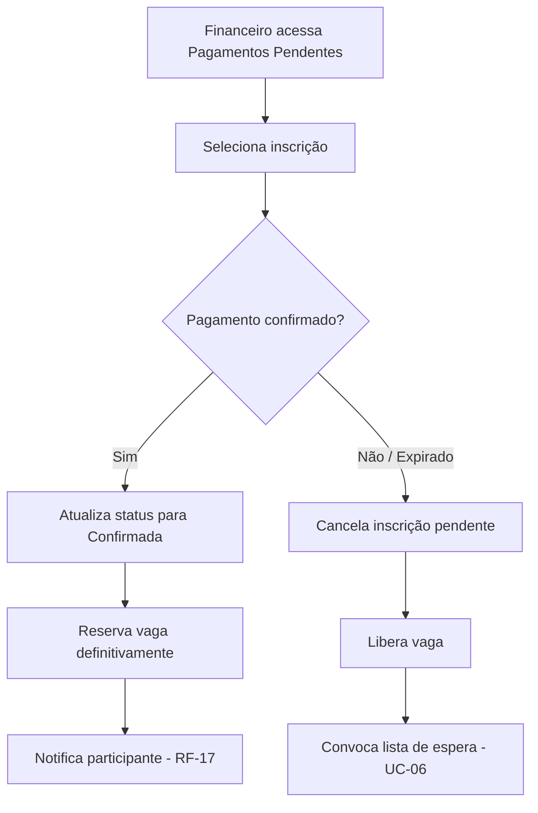
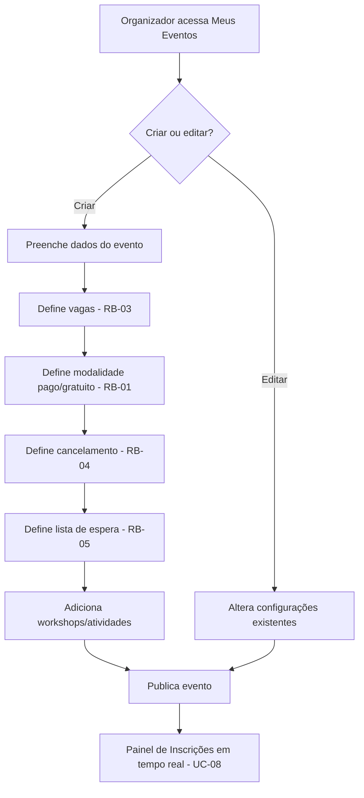
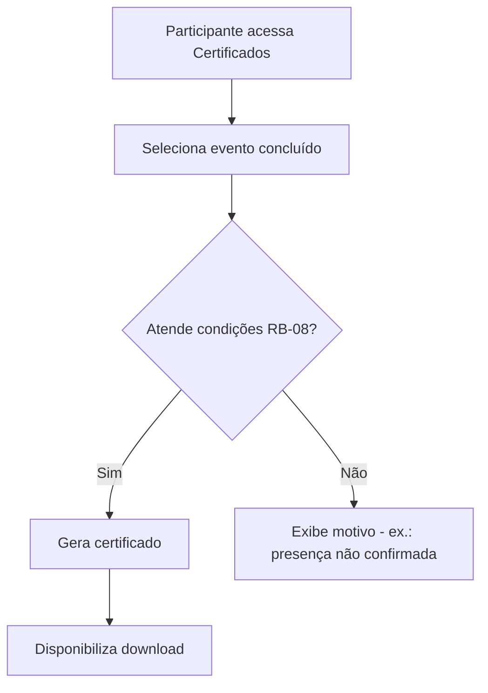
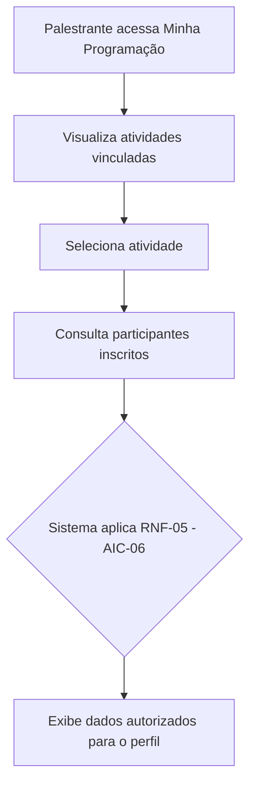
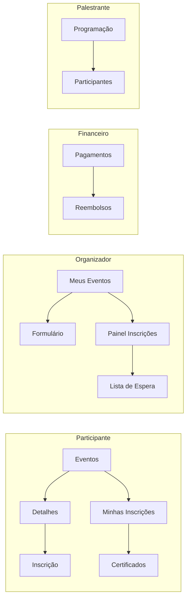

# Protótipos e Fluxos

> **Observação:** Descrições textuais de telas e fluxos derivados dos casos de uso (UC) e histórias de usuário (HU). Protótipos visuais de alta fidelidade deverão ser elaborados em etapa posterior.

---

## Perfis e áreas do sistema

| Perfil | Áreas principais |
|---|---|
| Participante | Eventos, Minhas Inscrições, Certificados |
| Organizador | Meus Eventos, Painel de Inscrições, Lista de Espera |
| Equipe Financeira | Pagamentos Pendentes, Reembolsos |
| Palestrante | Minha Programação, Participantes das Atividades |

---

## PF-01 — Fluxo de consulta e inscrição em evento

**Rastreabilidade:** UC-01, UC-02 | HU-01, HU-02 | PF-01

**Telas envolvidas:**
1. **Listagem de Eventos** — cards com nome, data, vagas e badge gratuito/pago/lotado.
2. **Detalhes do Evento** — descrição completa, programação de workshops, botão "Inscrever-se".
3. **Confirmação de Inscrição** — resumo da inscrição, status e link para comprovante.
4. **Lista de Espera** — confirmação de entrada na fila e posição estimada.

---

## PF-02 — Fluxo de inscrição em workshops

**Rastreabilidade:** UC-03 | HU-03 | RB-07

**Telas envolvidas:**
1. **Grade de Workshops** — horários em grade visual; workshops inscritos destacados.
2. **Alerta de Conflito** — modal informando sobreposição e opções disponíveis. ⚠️ AIC-03

---

## PF-03 — Fluxo de cancelamento e reembolso

**Rastreabilidade:** UC-04, UC-10 | HU-06, HU-14 | RB-04, RB-06

**Telas envolvidas:**
1. **Minhas Inscrições** — lista com status e ação "Cancelar" (quando disponível).
2. **Confirmação de Cancelamento** — resumo do impacto e informação sobre reembolso.
3. **Painel de Reembolsos (Financeiro)** — fila de solicitações pendentes.

---

## PF-04 — Fluxo de confirmação de pagamento

**Rastreabilidade:** UC-09 | HU-13 | RB-02

**Telas envolvidas:**
1. **Pagamentos Pendentes** — tabela com participante, evento, valor e data limite.
2. **Detalhe do Pagamento** — botões "Confirmar" e "Recusar/Expirar".

---

## PF-05 — Fluxo de gestão de eventos (Organizador)

**Rastreabilidade:** UC-07, UC-08 | HU-09, HU-10

**Telas envolvidas:**
1. **Formulário de Evento** — abas: Informações, Vagas e Regras, Programação.
2. **Painel de Inscrições** — gráficos e contadores de vagas ocupadas/disponíveis/lista de espera.

---

## PF-06 — Fluxo de emissão de certificado

**Rastreabilidade:** UC-11 | HU-08 | RB-08

**Telas envolvidas:**
1. **Meus Certificados** — lista de eventos elegíveis com status de emissão.
2. **Visualização/Download** — preview do certificado em PDF.

---

## PF-07 — Fluxo do palestrante

**Rastreabilidade:** UC-12, UC-13 | HU-15, HU-16

**Telas envolvidas:**
1. **Minha Programação** — agenda cronológica das apresentações.
2. **Participantes da Atividade** — lista filtrada conforme permissões do perfil. ⚠️ AIC-06

---

## Mapa de navegação simplificado

---

## Pontos pendentes para prototipação

| ID | Descrição | Impacto nos fluxos |
|---|---|---|
| AIC-01 | Regras de cancelamento e reembolso | PF-03 |
| AIC-02 | Lista de espera e reserva de vagas | PF-01, PF-03, PF-04, PF-05 |
| AIC-03 | Conflitos de horários | PF-02 |
| AIC-04 | Certificados e presença | PF-06 |
| AIC-05 | Notificações | PF-01, PF-03, PF-04 |
| AIC-06 | Permissões de acesso | PF-07 |
